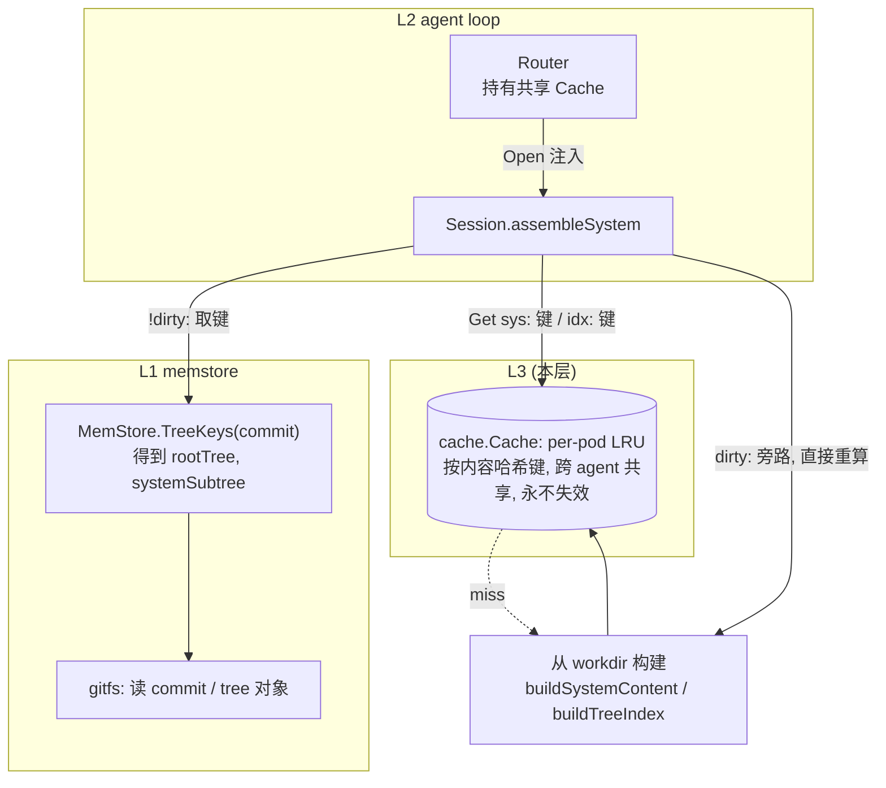
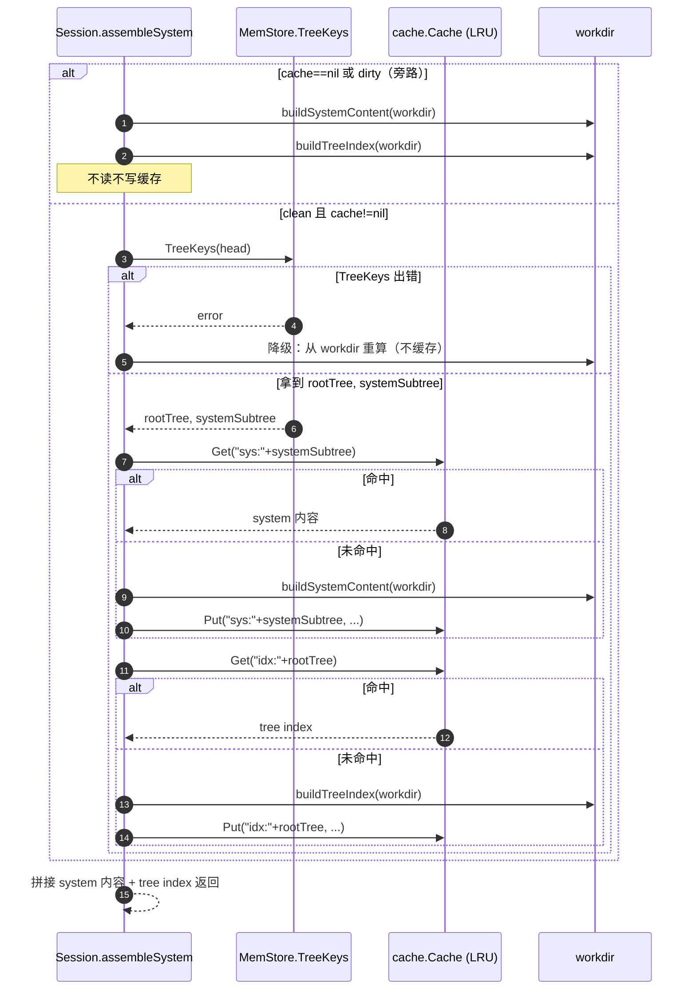

# Engram L3 — SHA 键读缓存设计

> 状态：已通过 brainstorm 评审（2026-06-22）。下一步：writing-plans 生成实现计划。
> 依赖 L1（MemStore）+ L2（agent loop / Session），均已合并 main。
> 北极星总架构见 `docs/architecture.md`（§4.4 内存缓存）。

## 0. 决策前提（已对齐）

1. **缓存键分两个粒度**（架构 §4.4 优化）：常驻 `system/` 内容按 **system/ 子树哈希** 键；tree index 按 **根 tree 哈希** 键。只改 `notes/` 的提交不会让 `system/` 缓存失效。
2. **dirty 时旁路全部缓存**：本轮有未提交编辑时 workdir≠HEAD，HEAD 派生的哈希键会失真，故直接从 workdir 重算（不读不写缓存）。不做"只改非 system/ 就保留 system 缓存"的精细化（YAGNI，列为未来优化）。
3. **缓存跨 agent 共享、按内容哈希键**：内容寻址键全局唯一，单个 per-pod LRU 即可，顺带跨 agent 去重。非 per-agent。
4. **Session 的 cache 字段 nil 安全**：`cache==nil` 时永远重算（退化为 L2 行为），既有 L2 测试无需改动。
5. **缓存是优化、不是真相源**：clean 路径若 `TreeKeys` 读失败，降级为重算，绝不让一次读失败搞挂一轮。

## 1. 范围

### In scope（L3）
- `internal/cache`：`Cache` 接口 + 线程安全、按条目数上限淘汰的 `LRU`（per-pod，跨 agent 共享）。
- `internal/memstore`：给 `MemStore` 接口 + `*Store` 加 `TreeKeys(ctx, at CommitHash) (rootTree, systemSubtree CommitHash, error)`；底层在 `gitfs` 读 commit/tree 对象。
- `internal/agent/session.go`：重构 `assembleSystem` 走缓存（clean）/ 旁路（dirty）；拆出纯函数 `buildSystemContent` / `buildTreeIndex`；Session 加 `cache` 字段（nil 安全）。
- `internal/agent/router.go`：持有共享 `cache.Cache`，`Open` 时注入 Session。
- `cmd/api/main.go`：构造 `cache.NewLRU(N)` 注入 Router。

### Out of scope（后续层）
- L4：trigram 索引 + 真实 recall + Reindex（本层 recall 仍是 grep 桩）。
- L5：River 消费维护 job、多 pod sticky 路由、共享 Redis 二级缓存（本层只 per-pod LRU；接口为多层预留）。
- "只改非 system/ 保留 system 缓存"的精细化 dirty 处理。

## 2. 继承的不变量（L3 不得破坏）

- 对象不可变、内容寻址；唯一可变指针 `agent_id→HEAD` 经单点 CAS。
- **缓存/索引/工作副本是派生、可丢弃**；对象 + ref 才是权威。L3 缓存命中必须等价于重算，miss 必须能从 workdir/对象重建。
- `system/` 保持小而精（每轮入上下文）。recall 不做推理前 top-k 灌入。
- `context.Context` 首参；`%w` 包错；小接口、表驱动测试。

## 3. 组件设计

### 3.1 架构总览



### 3.2 assembleSystem 决策时序



### 3.3 `internal/cache`

```go
// Package cache is a SHA-keyed, invalidation-free read cache. Keys are content
// hashes (immutable), so a hit is always equivalent to recomputation and
// "invalidation" degrades to LRU eviction for space. One per-pod instance is
// shared across agents/sessions; identical resident content dedups naturally.
package cache

// Cache stores immutable string values keyed by a content hash.
type Cache interface {
	Get(key string) (string, bool)
	Put(key, val string)
}

// LRU is a size-bounded (by entry count), mutex-guarded Cache.
type LRU struct { /* maxEntries, mu, map + eviction list */ }

func NewLRU(maxEntries int) *LRU
func (l *LRU) Get(key string) (string, bool)
func (l *LRU) Put(key, val string)
```
- 经典 LRU：`container/list` 双向链 + `map[string]*list.Element`，`sync.Mutex` 守护；超过 `maxEntries` 淘汰最久未用。`maxEntries<=0` 视为无界（dev）或取一个默认下限——实现时 `<=0` 取默认（如 1024）。
- 值是字符串（拼好的 system 内容片段 / tree index 文本）。不缓存结构体，保持简单。

### 3.4 `memstore.TreeKeys`

加到 `MemStore` 接口与 `*Store`：
```go
// TreeKeys returns the root tree hash and the system/ subtree hash for the
// commit `at`. systemSubtree is "" when no system/ directory exists. Used by
// the read cache: tree index is keyed by rootTree (busts on any change),
// resident system/ content by systemSubtree (busts only on system/ changes).
TreeKeys(ctx context.Context, at CommitHash) (rootTree, systemSubtree CommitHash, error)
```
- 底层 `gitfs`：用 `Storage`(over objstore) 读 commit 对象 → 其 root tree 哈希；再读 root tree → 找名为 `system` 的子条目（类型 tree）→ 其哈希。go-git 的 `object.GetCommit` / `commit.Tree()` / `tree.Entries`。
- 不可变映射（commit→两个哈希），调用方可放心缓存；本设计直接每 clean 轮调用（O(1) 几个对象读，远比全树遍历 + 解析便宜），不额外缓存键解析（可选未来优化）。

### 3.5 Session 重构

```go
type Session struct {
	// ... 既有字段 ...
	cache cache.Cache // nil → always recompute (L2 behavior)
}
// NewSession 增参 cache（放在末尾或紧邻 release；nil 安全）
```
`assembleSystem(ctx)` 逻辑（见 §3.2 时序）：
```go
func (s *Session) assembleSystem(ctx context.Context) (string, error) {
	if s.cache == nil || s.dirty {
		return s.buildResident() // 纯重算，不碰缓存
	}
	rootTree, systemSubtree, err := s.store.TreeKeys(ctx, s.head)
	if err != nil {
		return s.buildResident() // 降级：缓存读键失败不应搞挂一轮
	}
	sys := s.cachedOrBuild("sys:"+string(systemSubtree), s.buildSystemContent)
	idx := s.cachedOrBuild("idx:"+string(rootTree), s.buildTreeIndex)
	return sys + idx, nil
}
```
- `buildSystemContent()` / `buildTreeIndex()`：把现 assembleSystem 的两段拆成纯函数（读 workdir 的 `system/` 内容 / 全树 path+description 索引）。`buildResident()` = 两者拼接。
- `cachedOrBuild(key, build)`：`Get` 命中即返回；否则 `build()` 后 `Put`。
- **注意**：`assembleSystem` 现在需要 `ctx`（调 TreeKeys）；Send 循环已有 ctx，传入即可。
- clean 不变量：`!dirty ⇒ workdir==HEAD`（物化后/提交后 workdir 与 HEAD 一致；只读轮不变），故"从 workdir 构建"的内容与 HEAD 派生哈希键一致、可安全缓存。

### 3.6 Router / cmd/api 接线
- `Router` 加 `cache cache.Cache` 字段；`NewRouter(store, prov, scratch, c)` 增参；`Open` 把 `r.cache` 传给 `NewSession`。
- `cmd/api`：`router := agent.NewRouter(store, prov, os.TempDir(), cache.NewLRU(1024))`。

## 4. 错误处理

- `TreeKeys` 对象读失败 → `%w` 包裹返回；`assembleSystem` clean 路径捕获后**降级重算**（不返回错误）。
- LRU 并发安全（mutex）；`Get`/`Put` 不返回错误（纯内存）。
- 缓存值是不可变内容快照；不存在失效逻辑，只有容量淘汰。

## 5. 测试策略（表驱动）

- **cache.LRU**：put/get 往返；超过 `maxEntries` 逐出最久未用；命中提升新近度；`<=0` 取默认上限；并发 `-race`（多 goroutine Get/Put）。
- **memstore.TreeKeys**（live PG）：建 agent（含 system/ + notes/）→ commitA；再只改 notes/ → commitB；断言 `rootTree(A)!=rootTree(B)` 但 `systemSubtree(A)==systemSubtree(B)`；再改 system/ → commitC，断言 `systemSubtree(C)!=systemSubtree(A)`。无 system/ 时 systemSubtree=="".
- **Session 集成**（live PG，注入**计数 spy cache** 记录 Get/Put/build 次数；build 计数通过在 buildSystemContent/buildTreeIndex 注入计数器或用 spy 的 miss 次数推断）：
  - 只读多步同 HEAD：第二步起 `sys:`/`idx:` 命中，构建各只发生一次。
  - 编辑轮：`dirty` 后旁路——断言该步未对 cache 发起 Get（spy 计数不增）。
  - 只改 notes/ 的提交后下一轮：`sys:` 键不变 → 命中；`idx:` 键变 → 未命中重建。
  - `cache==nil`：行为同 L2（既有 Session 测试继续传 nil 通过）。

## 6. L3 完成标志（DoD）

Session 在 clean 多步 / 跨只读轮中复用缓存的常驻 system + tree index（每键只构建一次）；编辑轮正确旁路；只改非 `system/` 的提交后 system 缓存仍命中、tree index 重建；`cache==nil` 退化为 L2 行为；`memstore.TreeKeys` 的两个哈希按预期粒度变化；LRU `-race` 干净。全套 `go test ./...` 绿。

## 7. 守则（继承自 CLAUDE.md）

- 缓存/索引/工作副本不是真相源——派生、可丢弃；命中≡重算。
- 不在 ref CAS 之外加并发控制（LRU 的 mutex 是缓存内部数据结构保护，非系统级一致性点）。
- `system/` 不无界增长。
- 不 shell out git；TreeKeys 走 go-git 读对象，不直触对象后端字节。
