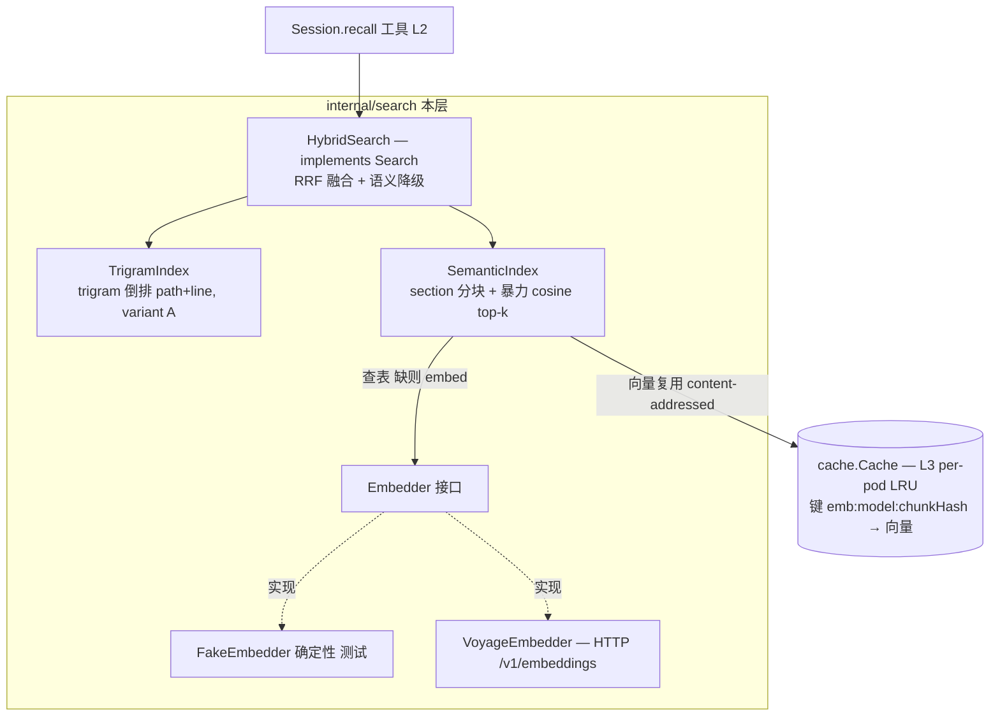
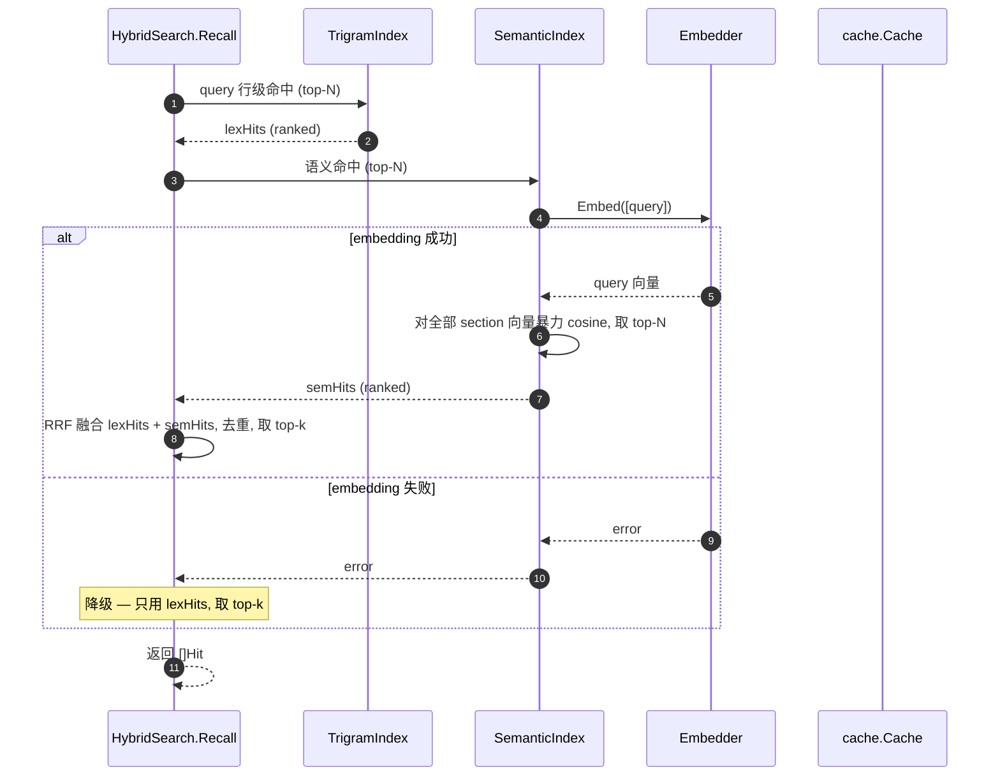

# Engram L4 — Hybrid 召回（trigram + 语义）设计

> 状态：已通过 brainstorm 评审（2026-06-22）。下一步：writing-plans。
> 依赖 L1（MemStore）+ L2（agent loop / Session / Router / Search 接口）+ L3（cache.Cache），均已合并 main。
> 北极星：`docs/architecture.md` §4.5（search variant A）、§15.2（2026 hybrid 最佳实践，本层把它从"未来 A/B 候选"落地）。

## 0. 决策前提（已对齐）

1. **Hybrid 一步到位**：trigram（精确 token）+ 语义向量（换述）+ **RRF 融合**。
2. **Embedder = 接口 + Fake + Voyage**：`FakeEmbedder` 确定性驱动所有测试；`VoyageEmbedder`（`voyage-3`，`VOYAGE_API_KEY`）mock-HTTP 测试、cmd/api 真跑。Anthropic 不做 embedding，故另接 Voyage（Anthropic 生态推荐）。
3. **分块按 markdown `^#` 标题切 section**（无标题→整文件/按空行）；每块记行范围 → 一个向量。
4. **暴力 cosine**（非 ANN）：单 agent section 数小，O(n) 正确零依赖。
5. **embedding 复用 L3 的 `cache.Cache`**：向量编码为字符串存同一 per-pod LRU，键 `emb:{model}:{chunkHash}`，内容寻址 ⇒ 每段唯一内容一生只 embed 一次、跨 agent 去重。
6. **语义服务故障 → 降级为纯 trigram**：召回是优化，不因 embedding 挂掉而整体失败。
7. **增量 reindex（git diff old..new）+ 维护 worker 驱动归 L5**；本层索引每 session 从 workdir 构建。
8. **`Search` 接口不变**：`HybridSearch` 是新实现，recall 工具 / Session / Router 调用面零改动，只换注入实现。

## 1. 范围

### In scope（L4）
- `internal/search/trigram.go`：`TrigramIndex`——逐行 trigram 倒排（variant A），查询零对象存储访问。
- `internal/search/embedder.go`：`Embedder` 接口 + `FakeEmbedder`。
- `internal/search/voyage.go`：`VoyageEmbedder`（HTTP `/v1/embeddings`，可注入 client）。
- `internal/search/semantic.go`：`SemanticIndex`——section 分块 + content-addressed embedding 缓存 + 暴力 cosine。
- `internal/search/hybrid.go`：`HybridSearch`（实现 `Search`）——RRF 融合 trigram + 语义，语义失败降级。
- `internal/agent/router.go`：`Open` 构造 per-session `HybridSearch`（注入 Embedder + 共享 cache），替换 `GrepSearch`。
- `cmd/api/main.go`：按 env 构造 `FakeEmbedder` | `VoyageEmbedder`，传入 Router。

### Out of scope（后续层 / 保留）
- L5：增量 reindex（`git diff old..new` 只重建变更块）+ 维护 worker 驱动 reindex job；多 pod 索引归属。
- ANN/HNSW（规模逼近时再上）；reranker；多向量/late-interaction。
- `GrepSearch` 保留在包内供测试/降级参考，但默认实现换成 `HybridSearch`。

## 2. 继承的不变量（L4 不得破坏）

- 索引是**派生、可丢弃**视图；可从 workdir/对象重建；命中等价于对当前内容的检索。
- recall 是 **agentic、mid-loop**，返回**子文件行范围**（predicate pushdown），不做推理前 top-k 灌入、不返回整文件。
- embedding 缓存键内容寻址、不可变 ⇒ 无失效逻辑（同 L3）。
- `context.Context` 首参；`%w` 包错；小接口；表驱动测试；不触真外部 API（测试用 Fake / mock-HTTP）。

## 3. 组件设计

### 3.1 架构总览



### 3.2 recall 时序（hybrid + 降级）


（注：SemanticIndex 构建期已把各 section 向量经 `C` 取好；§3.2 只画查询期的 query-embedding 调用。构建期见 §3.5。）

### 3.3 TrigramIndex（`internal/search/trigram.go`）

```go
type TrigramIndex struct {
	postings map[string][]posting // trigram -> (path, line)
	lines    map[string][]string  // path -> lines (for substring verify + snippet)
}
type posting struct { path string; line int } // 1-based line
func BuildTrigram(files map[string][]byte) *TrigramIndex
func (t *TrigramIndex) Search(query string, k int) []Hit
```
- 构建：每文件按行；对每行内容抽 3-char trigram（小写、滑动窗口），`postings[tri]` 追加 `(path,line)`；保存行文本。
- 查询：取 query 的 trigram；若 query 长度 <3 退化为全行子串扫描；否则对 query trigram 求**候选行交集**（出现全部 query-trigram 的行）→ 对候选行 `strings.Contains(lowerLine, lowerQuery)` 校验 → 命中行 → `Hit{path, line, line, 行文本}`；按 (path,line) 稳定排序，截断 k。
- variant A：索引自带行文本，查询零对象存储访问。

### 3.4 Embedder（`internal/search/embedder.go` + `voyage.go`）

```go
type Embedder interface {
	Embed(ctx context.Context, texts []string) ([][]float32, error)
	Model() string // 用于 embedding 缓存键，确保换模型不串味
}
```
- `FakeEmbedder{dim int}`：确定性——对每个文本算一个稳定向量（如：按 token 哈希散布到 dim 维 + L2 归一化），保证语义"近"的可控（测试构造能区分的文本）。`Model()="fake"`。
- `VoyageEmbedder`：POST `{baseURL}/v1/embeddings`，头 `Authorization: Bearer {VOYAGE_API_KEY}`，body `{model, input:[...]}`；解析 `data[].embedding`。默认 `model=voyage-3`、`baseURL=https://api.voyageai.com`、`client` 可注入。`Model()` 返回配置模型。非 2xx → `%w` 错误。

### 3.5 SemanticIndex（`internal/search/semantic.go`）

```go
type SemanticIndex struct {
	emb    Embedder
	cache  cache.Cache // L3 LRU, content-addressed embedding cache (may be nil)
	chunks []chunk
}
type chunk struct { path string; lineStart, lineEnd int; vec []float32 }
func BuildSemantic(ctx, emb Embedder, c cache.Cache, files map[string][]byte) (*SemanticIndex, error)
func (s *SemanticIndex) Search(ctx, query string, k int) ([]Hit, error)
```
- 分块：每文件按 `^#`（任意级别 markdown 标题行）切 section；首个标题前的内容为一块；无标题→整文件一块。每块记 `path, lineStart, lineEnd`（1-based 闭区间）+ 文本。
- 取向量（构建期）：对每块算内容哈希 `h`（如 sha256(model + "\n" + 内容)）；键 `emb:{model}:{h}`；`cache.Get` 命中 → 解码向量；未命中 → 收集待 embed。一次 `emb.Embed(missingTexts)` 批量取，逐个编码 `Put`。`cache==nil` 则全部走 embed、不缓存。
- 查询：`emb.Embed([query])` 得 query 向量；对每块 `cosine(query, chunk.vec)` → 取 top-k → `Hit{path, lineStart, lineEnd, section 首行/摘要}`。Embed 失败 → 返回 error（HybridSearch 据此降级）。
- 向量编解码：`float32` 切片 ↔ 字符串（小端字节 + base64，或 `encoding/gob`）；编码函数随实现，往返一致即可。

### 3.6 HybridSearch（`internal/search/hybrid.go`，实现 `Search`）

```go
type HybridSearch struct {
	tri *TrigramIndex
	sem *SemanticIndex
}
func NewHybrid(ctx, emb Embedder, c cache.Cache, files map[string][]byte) (*HybridSearch, error) // 构建 tri + sem
func (h *HybridSearch) Recall(ctx, agentID, query string, k int) ([]Hit, error)
func (h *HybridSearch) Reindex(ctx, agentID, from, to string) error // L4: no-op（增量重建归 L5）
```
- `Recall`：`lex := tri.Search(query, N)`；`sem, err := semantic.Search(ctx, query, N)`；`err != nil` → **降级**：只用 `lex`，截 k 返回（不报错）。否则 **RRF 融合**：`score(item) = Σ_over_lists 1/(rrfK + rank_in_list)`（`rrfK=60`），item 以 `path:lineStart-lineEnd` 为身份去重合并分数；按分降序，截 top-k。`N` 取如 `max(k, 10)`。
- 身份/去重：trigram 行级 Hit（`line..line`）与语义 section 级 Hit（`start..end`）粒度不同 → 各自为独立 item；完全相同的 `path:start-end` 合并。重叠（行落在 section 内）不强行合并（模型同时拿到精确行 + section 上下文，可接受）。
- 构建在 `NewHybrid`：trigram 同步构建；semantic 构建可能调 embed（构建期），失败则……见错误处理。

### 3.7 wiring（Router / cmd/api）

- `Router` 增 `emb search.Embedder` 字段（+ 已有的共享 `cache`）；`NewRouter(store, prov, scratch, c cache.Cache, emb search.Embedder)`。`Open` 物化 workdir 后，读取 workdir 全部文件为 `map[path][]byte`，`search.NewHybrid(ctx, r.emb, r.cache, files)` 构造 per-session Search，注入 Toolset（替换 `search.NewGrep(workdir)`）。
- `cmd/api`：按 `ENGRAM_EMBEDDER`（`fake`|`voyage`）构造 Embedder（voyage 需 `VOYAGE_API_KEY`），传入 `NewRouter`。

## 4. 错误处理

- **构建期 semantic embed 失败**：`NewHybrid` 不整体失败——记录降级状态，`sem=nil`，`Recall` 退化为纯 trigram。（构建期一次性 embed 整个 workdir 的失败不该让会话开不起来。）
- **查询期 query-embed 失败**：`SemanticIndex.Search` 返回 error → `HybridSearch.Recall` 降级为纯 trigram。
- Voyage 非 2xx / 解析失败 → `%w` 包裹。
- embedding 缓存读写不返回错误（纯内存）；`cache==nil` 合法（不缓存、每次 embed）。
- `context` 首参贯穿 embed 调用，支持取消。

## 5. 测试策略（表驱动；Fake / mock-HTTP，不触网）

- **TrigramIndex**：命中行范围 + 子串校验；query<3 字符退化扫描；无命中；k 截断；多文件。
- **FakeEmbedder**：确定性（同输入同输出）；构造三段文本使 cosine 排序可预测（query 与"近"段 > 与"远"段）。
- **VoyageEmbedder**：mock `http.RoundTripper`——断言请求（model/input/Authorization 头、POST /v1/embeddings）+ 用录制响应解析 `data[].embedding`；非 2xx → error。**不触真 API。**
- **SemanticIndex**：section 分块行范围正确（按标题切）；查询返回语义最近块；**embedding 缓存**——用 spy embedder 计数：同内容第二次构建 0 次 embed 调用（全缓存命中）；`cache==nil` 时每次都 embed。
- **HybridSearch RRF**：trigram-only 命中（语义无关词）、semantic-only 命中（换述、无共享 token）、两者都命中时融合排序合理；**降级**——注入构建期/查询期失败的 embedder，断言仍返回 trigram 结果且不报错。
- **Router**：`Open` 注入的 Search 是 HybridSearch（in-package 断言类型/非空）；既有 Session/Router 测试在传入 FakeEmbedder 后仍绿。
- 全套 `go test ./...` + `-race`（cache/search/agent）。

## 6. L4 完成标志（DoD）

recall 走 hybrid：trigram 抓精确 token、语义抓换述，RRF 融合返回行范围 / section 行范围 Hit；embedding 内容寻址缓存使重复内容只 embed 一次（spy 计数证实）；embedding 服务（构建期或查询期）故障时优雅降级为纯 trigram、不报错；FakeEmbedder 全自动覆盖融合/降级/缓存，VoyageEmbedder mock-HTTP 覆盖请求/解析；recall 工具 / Session / Router 调用面零改动；`cmd/api` 可用 Voyage 真跑。全套 `go test ./...` + `-race` 绿。

## 7. 守则（继承自 CLAUDE.md）

- 索引/缓存是派生、可丢弃；对象 + ref 才是权威。
- recall 不做推理前 top-k 灌入；返回行范围，长尾 mid-loop 拉取。
- 不在 ref CAS 之外加并发控制。
- 不 shell out git；不直触对象后端字节。
- 依赖轻量：trigram/cosine/RRF 全自研走标准库；唯一新外部依赖是 Voyage HTTP（behind Embedder 接口，可换/可 Fake）。
