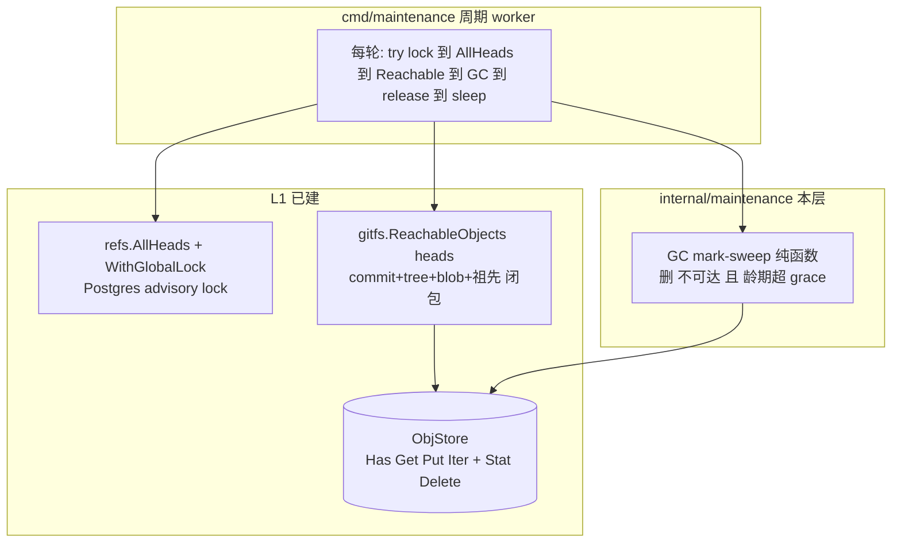
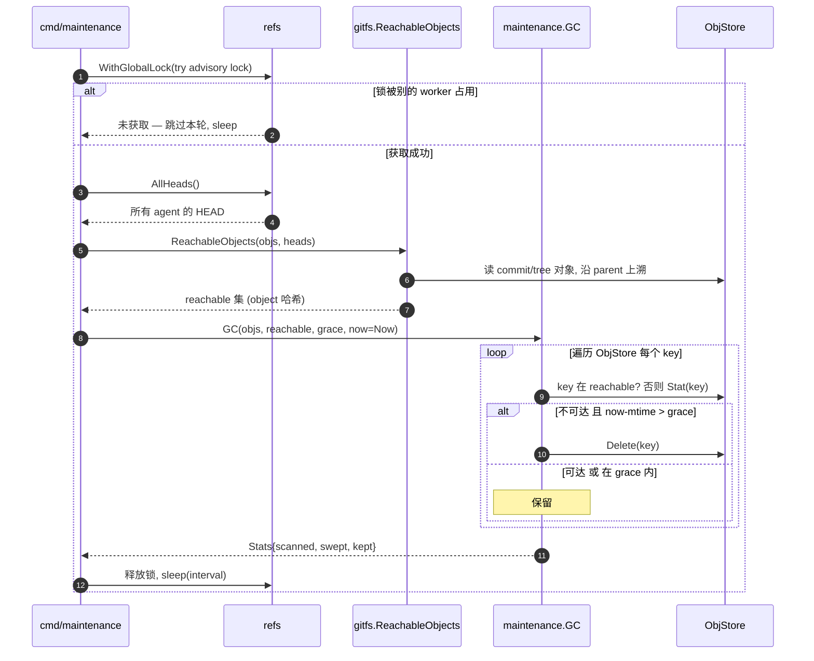

# Engram L5a — 维护 worker 骨架 + GC 设计

> 状态：已通过 brainstorm 评审（2026-06-23）。下一步：writing-plans。
> 依赖 L1（MemStore/objstore/gitfs/refs）已合并 main。
> 北极星：`architecture.md` §6.2（GC）、§7（维护 worker）、§8.2（写序：先对象后 ref）。
> L5 被拆分：**L5a = worker 骨架 + GC**（本文）；reflection（L5b）、defrag（L5c）各自后续；reindex 移出（L4 索引每 session 重建、暂无持久索引可增量更新）。

## 0. 决策前提（已对齐）

1. **范围 = worker 骨架 + GC**（无 LLM、可测）。reflect/defrag 留后续。
2. **GC 全局**：可达集 = 所有 agent HEAD 的并集（对象内容寻址、跨 agent 去重，per-agent GC 会误删共享对象）。
3. **龄期宽限防误删 in-flight**：写序是"先对象后 CAS ref"，in-flight commit 的对象已落盘但 ref 未指过去、暂时不可达；只删"不可达 **且** 创建超过 grace（默认 1h）"的对象，秒级年龄的 in-flight 对象永不被扫。
4. **GC 接收预算好的 reachable 集**：`maintenance.GC` 是纯函数（输入 objs + reachable 集 + grace + 注入的 now），可用内存 ObjStore 全自动测试；reachable 集由调用方用 `gitfs.ReachableObjects` 算。
5. **全局 advisory lock**（`pg_try_advisory_lock`）：多 pod 下同时只有一个 worker GC；拿不到就跳过本轮。
6. **GC 不走 memory_jobs 队列**：GC 是周期全局任务、定时循环触发；`memory_jobs` 的 dequeue 消费（reflect/reindex）留 L5b。

## 1. 范围

### In scope（L5a）
- `internal/memstore/objstore`：`ObjStore` 接口加 `Stat(ctx,key)(time.Time,error)` + `Delete(ctx,key)error`；本地 FS 后端实现。
- `internal/memstore/gitfs`：`ReachableObjects(ctx, objs, heads []string) (map[string]struct{}, error)`。
- `internal/memstore/refs`：`AllHeads(ctx)([]string,error)`；全局 advisory lock 辅助（`WithGlobalLock`）。
- `internal/maintenance`：`GC(ctx, objs, reachable, grace, now) (Stats, error)`（纯函数 mark-sweep）。
- `cmd/maintenance`：周期 worker 进程（env 配置 + advisory lock + AllHeads + ReachableObjects + GC）。

### Out of scope（后续）
- L5b：reflection（LLM 驱动整合）+ memory_jobs dequeue 消费（reconcile-loop vs River 那时定）+ per-agent 单例锁。
- L5c：defrag。
- reindex（待索引持久化后）。
- 对象的 packfile 压缩 / 分层存储。

## 2. 继承的不变量（L5a 不得破坏）

- 对象不可变、内容寻址；唯一可变指针 `agent_id→HEAD` 经单点 CAS。GC **只删不可达对象**，绝不动可达对象、绝不动 ref。
- **维护不阻塞前台**：GC 用龄期宽限 + 全局 advisory lock，不取 agent 写锁、不停写。
- 缓存/索引/工作副本是派生、可丢弃；对象 + ref 才是权威。GC 删的是"崩溃孤儿"，不是数据。
- `context.Context` 首参；`%w` 包错；小接口；表驱动测试；不触真外部服务。

## 3. 组件设计

### 3.1 架构总览



### 3.2 GC 一轮时序



### 3.3 ObjStore 扩展（`internal/memstore/objstore`）

接口新增（现有 Has/Get/Put/Iter 不变）：
```go
type ObjStore interface {
	Has(ctx context.Context, key string) (bool, error)
	Get(ctx context.Context, key string) ([]byte, error)
	Put(ctx context.Context, key string, data []byte) error
	Iter(ctx context.Context, fn func(key string) error) error
	Stat(ctx context.Context, key string) (time.Time, error) // 对象创建/修改时间, 缺失 → ErrNotFound
	Delete(ctx context.Context, key string) error             // 删除, 缺失为幂等无错
}
```
- 本地 FS 后端：`Stat` = `os.Stat(path).ModTime()`（缺失 → `ErrNotFound`）；`Delete` = `os.Remove(path)`（`os.ErrNotExist` 视为成功，幂等）。
- 注：mtime 作为"对象年龄"代理——本地后端对象写入后不再改动（不可变），mtime ≈ 创建时间。S3 后端用 LastModified，同理。

### 3.4 gitfs.ReachableObjects（`internal/memstore/gitfs`）

```go
// ReachableObjects returns the set of all object hashes reachable from the given
// commits: each commit, every commit's full tree (subtrees + blobs), and all
// ancestor commits via parent links (history is kept for diffability).
func ReachableObjects(ctx context.Context, objs objstore.ObjStore, heads []string) (map[string]struct{}, error)
```
- 用 `NewStorage(ctx, objs)` + go-git：对每个 head，`object.GetCommit` → 加入 commit 哈希；`commit.Tree()` 递归遍历（`tree.Files()` / tree entries）把 tree + 子树 + blob 哈希全加入；再沿 `commit.Parents()` 上溯所有祖先 commit（去重、防环）重复。
- 空 head（`""`）跳过。重复 head/共享祖先靠 set 去重。
- 错误（读对象失败）`%w` 返回。

### 3.5 refs 扩展（`internal/memstore/refs`）

```go
// AllHeads returns every agent's current HEAD (the GC reachability roots).
func (r *Refs) AllHeads(ctx context.Context) ([]string, error) // SELECT head FROM agent_refs

// WithGlobalLock tries a Postgres session-level advisory lock (pg_try_advisory_lock).
// If acquired, runs fn and releases; ran=false means another worker holds it.
func (r *Refs) WithGlobalLock(ctx context.Context, key int64, fn func(context.Context) error) (ran bool, err error)
```
- `WithGlobalLock`：从 pool 取一个**专用 conn**，`SELECT pg_try_advisory_lock($1)`；false → 返回 `ran=false`（不运行 fn）；true → `defer pg_advisory_unlock($1)` + conn.Release，运行 fn，返回 `ran=true, fn 的 err`。GC 用固定 key（如 `1` 常量 `gcLockKey`）。

### 3.6 maintenance.GC（`internal/maintenance`）

```go
type Stats struct { Scanned, Swept, Kept int }

// GC deletes objects that are unreachable AND older than grace (measured against
// now). reachable is the precomputed reachability set. Per-object Delete failures
// are best-effort: logged-by-counter and skipped, never abort the sweep.
func GC(ctx context.Context, objs objstore.ObjStore, reachable map[string]struct{}, grace time.Duration, now time.Time) (Stats, error)
```
- 遍历 `objs.Iter`：每个 key — `scanned++`；若在 reachable → `kept++`、continue；否则 `Stat(key)`：`now.Sub(mtime) > grace` → `Delete(key)`（成功 `swept++`；失败计入并继续）；否则（grace 内）`kept++`。
- 纯函数（不碰 refs/gitfs）：测试用内存 ObjStore + 手搭 reachable 集 + 受控 mtime + 注入 now。

### 3.7 cmd/maintenance（`cmd/maintenance/main.go`）

周期 worker：
- env：`ENGRAM_DB`（DSN）、`ENGRAM_OBJ`（对象根）、`ENGRAM_GC_INTERVAL`（默认如 5m）、`ENGRAM_GC_GRACE`（默认 1h）。
- 装配：pgxpool + `refs.New` + `refs.Migrate` + `objstore.NewLocal`。
- 循环：`refs.WithGlobalLock(ctx, gcLockKey, func)`，func 内：`heads := refs.AllHeads` → `reachable := gitfs.ReachableObjects(objs, heads)` → `stats := maintenance.GC(objs, reachable, grace, time.Now())` → log stats。`ran=false` → log skip。`sleep(interval)`。
- 用途：dev 跑 GC；不属自动测试（`go build` + 可选冒烟）。

## 4. 错误处理

- `%w` 包错，`context` 首参。
- advisory lock 未获取 → `ran=false`，跳过本轮、不报错。
- GC 单对象 Delete 失败 → 计数并继续（best-effort），整轮返回累计 Stats + 可选首个错误（设计为：返回 Stats 且仅在遍历本身失败时返回 err；单对象删除失败不 abort）。
- `Stat` 在并发下对象恰好被删（不该发生，GC 是唯一删除者且持全局锁）→ `ErrNotFound` 视为已不在、`kept++`/跳过。
- `ReachableObjects` 读对象失败 → 返回 err，GC 本轮不运行（**绝不**在可达集不完整时清扫——否则会误删）。这是关键安全点：reachable 计算失败必须中止本轮 GC。

## 5. 测试策略（表驱动）

- **objstore Stat/Delete**：本地后端 Put 后 `Stat` 返回非零 mtime；缺失 `Stat` → `ErrNotFound`；`Delete` 后 `Has`=false；`Delete` 缺失键幂等无错。
- **gitfs.ReachableObjects**（无 DB）：用 `gitfs.Commit` 建 commitA（system/+notes/）→ commitB（基于 A 改 notes）；`ReachableObjects([B])` 含 B、A（祖先）、两者的 tree/blob；建一个**孤立对象**（直接 objstore.Put 一段假内容）→ 断言它**不在**可达集。
- **maintenance.GC**（无 DB、无 git，内存 ObjStore）：构造内存 store 实现完整 ObjStore（含 Stat/Delete，每对象可设 mtime）；放：① 可达对象（在 reachable 集，mtime 很老）→ 保留；② 老孤儿（不在 reachable、mtime < now-grace）→ 删除；③ 新孤儿（不在 reachable、mtime 在 grace 内）→ 保留。注入 now。断言 Stats{scanned=3, swept=1, kept=2} 且只有老孤儿被删。
- **refs.AllHeads / WithGlobalLock**（live PG）：Bootstrap 两个 agent → `AllHeads` 含两个 head；`WithGlobalLock` 第一次 `ran=true`、嵌套/并发第二次（另一个 conn 持锁时）`ran=false`。
- **cmd/maintenance**：`go build ./...` + 可选：起 PG、seed 一个 agent + 一个老孤儿对象，跑一轮，断言孤儿被删（手动/集成）。
- 全套 `go test ./...`（并行隔离已修）+ `-race`（maintenance/objstore）。

## 6. L5a 完成标志（DoD）

`cmd/maintenance` 周期跑：取全局 advisory lock → 算所有 agent 可达对象闭包 → 删除"不可达且龄期超 grace"的对象，**绝不**误删 in-flight/可达对象、**绝不**在可达集计算失败时清扫；`maintenance.GC` 纯函数用内存 store 全自动覆盖三类对象；`ObjStore` 新增 Stat/Delete 本地后端实现；`gitfs.ReachableObjects` 闭包含祖先；`refs.AllHeads`/`WithGlobalLock` 经 live PG 验证。全套 `go test ./...` + `-race` 绿。

## 7. 守则（继承自 CLAUDE.md）

- 不引入 Temporal/Kafka；GC 是周期定时 + 全局 advisory lock，最轻量。
- 不修改对象；GC 只删不可达孤儿。
- 并发控制：前台仍只在 ref CAS 这一个序列化点；GC 的全局 advisory lock 是维护侧准入，不触前台写路径。
- 不 shell out git；ReachableObjects 走 go-git 读对象。
- 维护不阻塞前台（龄期宽限 + 不取 agent 写锁）。
