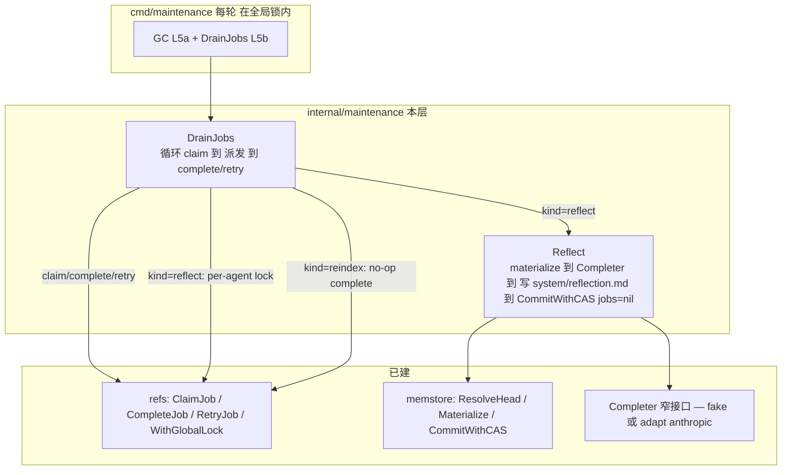
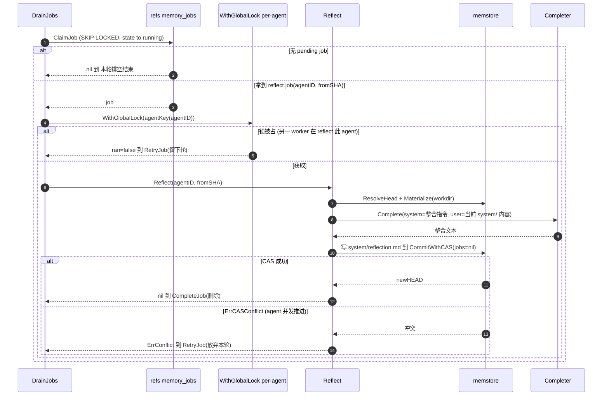

# Engram L5b — memory_jobs 消费 + Reflection 设计

> 状态：已通过 brainstorm 评审（2026-06-23）。下一步：writing-plans。
> 依赖 L1（refs/memstore，memory_jobs 同-tx 入队）+ L2（LLMProvider）+ L5a（cmd/maintenance、refs.WithGlobalLock）均已合并 main。
> 北极星：`architecture.md` §7（maintenance/reflection）、§8.3（reflection 在 compaction 触发）、§15.3（队列卫生）。
> L5b 之后仍剩：L5c defrag、真增量 reindex（待索引持久化）。

## 0. 决策前提（已对齐）

1. **消费机制 = Postgres SKIP LOCKED 消费 memory_jobs**（贴合已有同-tx 入队，依赖轻；River 留 drop-in）。
2. **CAS 冲突 → 放弃本轮、留 job 下轮重试**（不阻塞前台、无有损合并、不浪费 LLM）。reflection 周期性、best-effort。
3. **per-agent advisory lock 做 reflection 单例**（复用 L5a 的 `refs.WithGlobalLock`，key=hash(agentID)）。
4. **reflection 的 commit 不入队任何 reflect job**（jobs=nil）——否则无限自触发。这是必须的正确性点。
5. **reindex job 排空为 no-op**（每次 commit 入队 reindex，但索引每 session 重建、无持久化；必须排空防堆积）。真增量 reindex 后续。
6. **Completer 窄接口**（`Complete(ctx, system, user) (string, error)`），maintenance 不依赖 agent 包；测试用确定性 fake，cmd 里把 `agent` 的 provider 适配成 Completer。

## 1. 范围

### In scope（L5b）
- `internal/memstore/refs`：job-queue 消费方法 `ClaimJob` / `CompleteJob` / `RetryJob` + `DequeuedJob` 类型。
- `internal/maintenance`：`Completer` 接口；`Reflect(...)` 处理器；`DrainJobs(...)` runner。
- `cmd/maintenance`：每轮在全局锁内既跑 GC（L5a）又 `DrainJobs`；构造 Completer（fake|anthropic）。

### Out of scope（后续）
- L5c：defrag。
- 真增量 reindex（待 L4 索引持久化）。
- reflection 触发策略调优（每 N commit / compaction）——本层≈每有 commit 跑一次（partial-unique 去重），记为 tuning 旋钮。
- diff-since-fromSHA 的精细化整合输入（本层用当前 system/ 内容）。
- River 迁移。

## 2. 继承的不变量（L5b 不得破坏）

- 对象不可变、内容寻址；唯一可变指针 `agent_id→HEAD` 经单点 CAS。reflection 也走 `CommitWithCAS`——冲突时**放弃**（绝不有损合并、绝不覆盖 agent 的并发写入）。
- **维护不阻塞前台**：reflection 持 per-agent advisory lock 但 **不取 agent 的前台写锁**；前台 agent 写入照常经 CAS（reflection 输则退让）。
- 缓存/索引/工作副本派生可丢弃；对象 + ref 权威。
- 同-tx 入队 iff commit 提交（L1）——消费侧只读这张表。
- `context.Context` 首参；`%w` 包错；小接口；不触真外部服务（fake Completer / live PG）。

## 3. 组件设计

### 3.1 架构总览



### 3.2 一个 reflect job 的消费时序



### 3.3 refs job-queue 方法（`internal/memstore/refs`）

```go
type DequeuedJob struct {
	ID       int64
	AgentID  string
	Kind     string
	FromSHA  string
	Attempts int
}

// ClaimJob atomically claims one pending job (FOR UPDATE SKIP LOCKED, no ORDER
// BY — queue hygiene) and marks it 'running'. Returns nil if none pending.
func (r *Refs) ClaimJob(ctx context.Context) (*DequeuedJob, error)

// CompleteJob removes a finished job.
func (r *Refs) CompleteJob(ctx context.Context, id int64) error

// RetryJob increments attempts; if attempts < maxAttempts it returns the job to
// 'pending' (retried later), else marks it 'failed' (no infinite retry).
func (r *Refs) RetryJob(ctx context.Context, id int64, maxAttempts int) error
```
- `ClaimJob`：单 tx — `SELECT id, agent_id, kind, from_sha, attempts FROM memory_jobs WHERE state='pending' FOR UPDATE SKIP LOCKED LIMIT 1`；无行 → 提交、返回 nil；有行 → `UPDATE memory_jobs SET state='running' WHERE id=$1`、提交、返回 job。**无 ORDER BY**（§15.3 卫生：避免跨分区/死元组超线性退化）。
- `RetryJob`：`UPDATE ... SET attempts=attempts+1, state=CASE WHEN attempts+1>=$2 THEN 'failed' ELSE 'pending' END WHERE id=$1`。
- 注：claim 把 state 设 'running' 后，partial-unique-index（`WHERE state='pending'`）不再覆盖它，故同 agent 的下一个 commit 可再入队一个 pending reflect——per-agent advisory lock 防止真正并发执行两个 reflection。

### 3.4 Completer（`internal/maintenance`）

```go
// Completer is the narrow LLM surface reflection needs: one text completion.
// Keeps maintenance decoupled from the agent package's tool-use protocol.
type Completer interface {
	Complete(ctx context.Context, system, user string) (string, error)
}
```
- 测试：确定性 `fakeCompleter`（如返回 user 的摘要前缀，或固定文本）。
- cmd/maintenance：把 `agent.LLMProvider`（fake 或 Anthropic）适配成 Completer——构造一个 no-tools `agent.Request{System, Messages:[{user}]}`，`Generate` 后返回 `Response.Text`。适配器放 cmd（不让 maintenance 依赖 agent）。

### 3.5 maintenance.Reflect（`internal/maintenance/reflect.go`）

```go
var ErrConflict = errors.New("maintenance: reflect lost CAS race; retry later")

func Reflect(ctx context.Context, store memstore.MemStore, c Completer, agentID, fromSHA string) error
```
- 流程：`head := store.ResolveHead(agentID)`；`store.Materialize(agentID, head, workdir)`（临时目录，用完删）；读 `workdir/system/` 全部内容拼成 `current`；`out := c.Complete(ctx, reflectSystemPrompt, current)`；把 `out` 写入 `workdir/system/reflection.md`；`store.CommitWithCAS(ctx, agentID, head, workdir, nil)`（**jobs=nil**，防自触发）。
- `errors.Is(err, memstore.ErrCASConflict)` → 返回 `ErrConflict`。其它错 `%w` 返回。
- `reflectSystemPrompt` 常量：指示 LLM "把以下常驻记忆整合成一份简洁的当前状态笔记"。

### 3.6 maintenance.DrainJobs（`internal/maintenance/drain.go`）

```go
func DrainJobs(ctx context.Context, r *refs.Refs, store memstore.MemStore, c Completer, maxAttempts int) (int, error)
```
- 循环：`job := r.ClaimJob(ctx)`；nil → 结束，返回已处理数。否则按 `job.Kind` 派发：
  - `"reflect"`：`ran, err := r.WithGlobalLock(ctx, agentKey(job.AgentID), func(ctx) error { return Reflect(ctx, store, c, job.AgentID, job.FromSHA) })`。
    - `ran=false`（另一 worker 在 reflect 此 agent）→ `RetryJob`（留下轮）。
    - `ran=true, err==ErrConflict` → `RetryJob`（放弃本轮）。
    - `ran=true, err!=nil`（其它）→ `RetryJob`。
    - `ran=true, err==nil` → `CompleteJob`。
  - `"reindex"`：`CompleteJob`（no-op 排空）。
  - 其它未知 kind：`CompleteJob`（丢弃，避免卡队列）。
- `agentKey(agentID) int64`：稳定哈希（如 FNV-64）→ int64 lock key。
- 防饿死/无限循环：每轮 Drain 处理"当前 pending 集"即可；被 RetryJob 回 pending 的 job 下一**轮**（下次 cmd 循环）再试，不在本轮立即重抢（用一个已处理 id 集合或限定循环次数防本轮反复抢同一个 retry 回来的 job）。实现：本轮只 claim 到 nil 为止；RetryJob 设回 pending 的 job 因 attempts 变化/或本轮可能再被 claim——为避免本轮忙转，Drain 跟踪本轮已 touch 的 job id，跳过重复；或更简单：claim 时跳过 attempts 已增长且本轮见过的。**采用**：本轮维护一个 `seen map[int64]bool`，claim 到 seen 过的 job 立即 `break`（视为本轮无新活）。

### 3.7 cmd/maintenance 扩展

每轮（在全局 advisory lock 内，L5a 已有）依次：
1. GC（L5a：AllHeads → ReachableObjects → GC）。
2. `drained, err := maintenance.DrainJobs(ctx, r, store, completer, maxAttempts)`；log `drained`。
- `store`：需要一个 `memstore.MemStore`——cmd 现在只建了 objstore + refs；补建 `memstore.New(objstore, refs)`。
- `completer`：按 `ENGRAM_PROVIDER`（fake|anthropic）构造 agent provider 并适配成 Completer；anthropic 需 `ANTHROPIC_API_KEY`。
- `maxAttempts`：env `ENGRAM_JOB_MAX_ATTEMPTS`（默认如 5）。

## 4. 错误处理

- `ClaimJob`/`CompleteJob`/`RetryJob` 失败 `%w` 返回；`DrainJobs` 单个 job 处理出错不中止整轮（log + 继续/RetryJob），仅 claim 本身失败才返回 err。
- `ErrConflict` 哨兵：reflection 输掉 CAS → requeue（不算失败、不耗 attempts？——耗 attempts 以防活锁；超 maxAttempts → failed）。**决策**：ErrConflict 也走 RetryJob（attempts++），防一个永远冲突的 job 无限占用；超限 failed。
- reflection 的 `CommitWithCAS(jobs=nil)`：确保不再入队 reflect（防循环）。
- per-agent advisory lock 用 background ctx 解锁（L5a 已实现的 WithGlobalLock 行为）。
- `DrainJobs` 的 `seen` 集防本轮反复抢同一 requeued job。

## 5. 测试策略（表驱动）

- **refs job-queue**（live PG，per-test 唯一 agent id）：入队一个 job（用现有 CommitRef 或直接 INSERT）→ `ClaimJob` 返回它且 state 变 running → 再 `ClaimJob` 返回 nil（已不 pending）→ `CompleteJob` 删除（计数 0）。`RetryJob`：attempts++ 回 pending；attempts 达 maxAttempts → failed。SKIP LOCKED：两条 pending job，两次 claim 拿到不同 id。
- **maintenance.Reflect**（live PG + fakeCompleter）：CreateAgent → `Reflect(agentID, head)` → 断言新 HEAD 的树含 `system/reflection.md`(=fake 输出) 且该 commit **未入队 reflect job**（查 memory_jobs 无该 agent 的 pending reflect 来自此 commit）。冲突路径：Reflect 前用底层 store 外部推进 HEAD → 断言 `errors.Is(err, ErrConflict)`。
- **DrainJobs**（live PG + fakeCompleter + 计数）：对一个 agent 入队 reflect + reindex → `DrainJobs` → reflect 被处理（system/reflection.md 落地、job completed）、reindex 被排空（completed）、队列清空、返回 drained=2。per-agent-lock-held 路径：预先持有该 agent 的 advisory lock → DrainJobs 的 reflect 应 RetryJob（留 pending）不报错。
- **agentKey**：同 agentID 稳定、不同 agentID 大概率不同。
- **cmd/maintenance**：`go build` + 冒烟（seed agent + 入队 reflect，跑一轮，log 显示 drained≥1、system/reflection.md 出现）。
- 全套 `go test ./...`（隔离已修）+ `-race`（maintenance）。

## 6. L5b 完成标志（DoD）

维护 worker 每轮在全局锁内排空 memory_jobs：reflect job 在 per-agent advisory lock 下跑 Completer 整合、写 `system/reflection.md`、`CommitWithCAS(jobs=nil)`（不自触发循环），CAS 冲突则 requeue 下轮；reindex job 被 no-op 排空；超 maxAttempts 的 job 标 failed（不无限重试）；fakeCompleter 全自动覆盖闭环 + 冲突 + 锁占用路径；cmd/maintenance 同时跑 GC + DrainJobs。全套 `go test ./...` + `-race` 绿。

## 7. 守则（继承自 CLAUDE.md）

- 不引入 Temporal/Kafka；SKIP LOCKED 消费自有 memory_jobs，River 留 drop-in。
- 不修改对象；reflection 走 CommitWithCAS（先对象后 ref），冲突放弃不覆盖。
- 并发控制：前台仍只在 ref CAS 序列化；reflection 的 per-agent advisory lock 是维护侧单例闸，不取前台写锁、不阻塞前台。
- 不 shell out git。
- maintenance 不依赖 agent 包（Completer 窄接口）。
