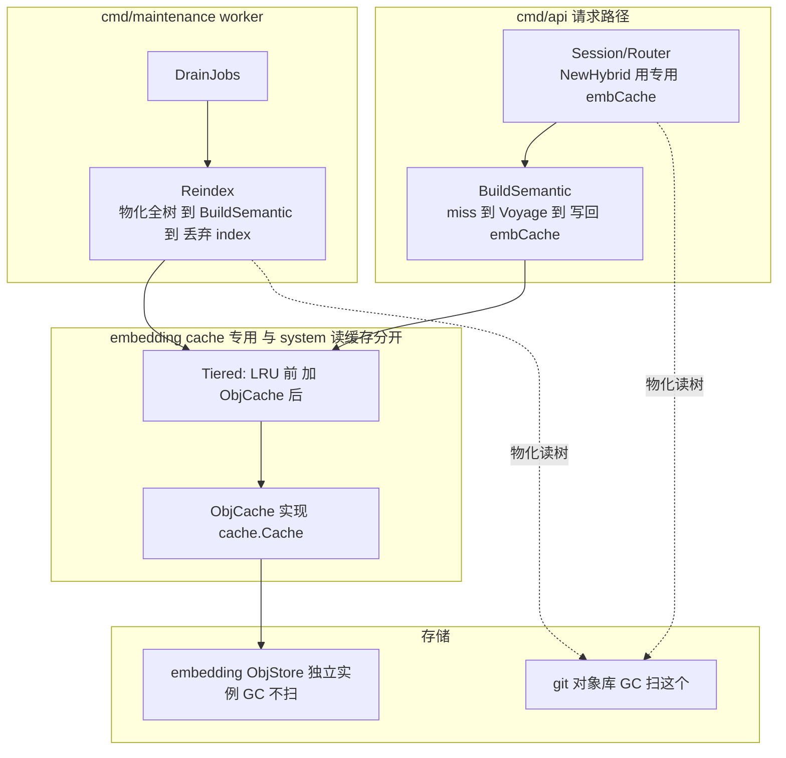
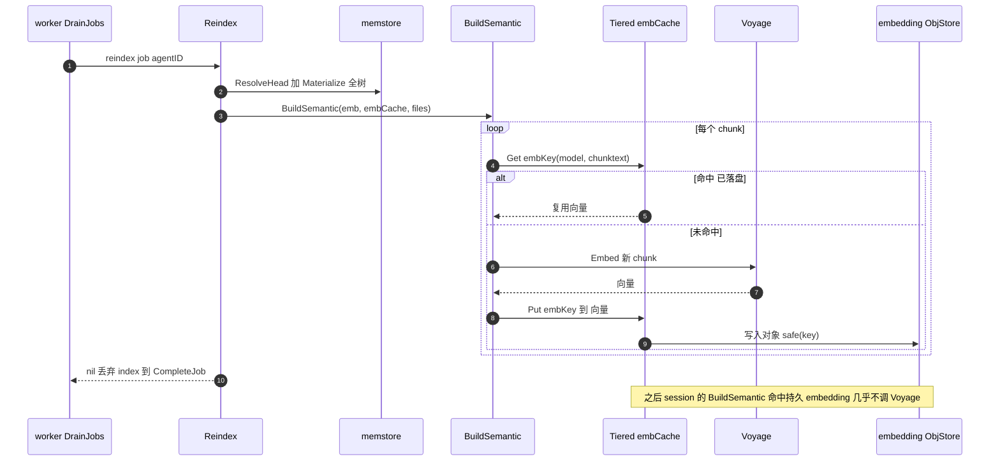

# Engram L4b — 搜索索引持久化 + 增量 reindex 设计

> 状态：已通过 brainstorm 评审（2026-06-24）。下一步：writing-plans。
> 扩展 L4（hybrid search）。依赖 L1（memstore/objstore）、L3（cache.Cache/LRU）、L4（search: BuildSemantic/HybridSearch）、L5b（DrainJobs/processJob、reindex job）均已合并 main。
> 北极星：`architecture.md` §2（search 读加速器、variant A 本地 trigram）、§7（maintenance reindex job）、§14（索引最终一致窗口）。
> L4b 之后仍剩：L5c defrag、stale-`running` job reaper、embedding 库淘汰策略。

## 0. 决策前提（已对齐）

1. **只持久化 embedding**（Voyage 调用昂贵）。trigram 仍每 session 本地重建（variant A：本地、纯 CPU、毫秒级、无 API 成本）。
2. **后端 = 独立内容寻址 ObjStore 实例**（embedding 本就是 hash(model+text) 内容寻址）。与权威 git 对象库**物理隔离**，**GC 不扫它**。
3. **近乎零侵入**：`BuildSemantic(ctx, emb, c cache.Cache, files)` 已经 miss→embed→`c.Put` 写回。提供一个持久化的 `cache.Cache` 注入即可，BuildSemantic 一行不改。
4. **reindex = 物化 HEAD 全树 → 跑 BuildSemantic（丢弃 index）**。副作用即落盘缺失 embedding；内容寻址 → 只 embed 新 chunk = 天然增量，无需 diff、无需 per-agent 锁。
5. **搜索 embedding cache 与 L3 system 读缓存分开**（不同 cache 实例），避免把 system 内容写进 embedding 库。

## 1. 范围

### In scope（L4b）
- `internal/cache`：`ObjCache`（cache.Cache over objstore.ObjStore）+ `Tiered`（front/back 组合）。
- `internal/maintenance`：`Reindex(ctx, store, emb, embCache, agentID) error`；`DrainJobs`/`processJob` 增 `emb`/`embCache` 参数，`reindex` 分支调 Reindex（替换 no-op）。
- `cmd/maintenance`：构造 embedder + embCache（Tiered{LRU, ObjCache}），传入 DrainJobs。
- `cmd/api` + `internal/agent/router`：搜索路径用专用 embCache（与 system 读缓存分离），session 读/写持久 embedding。

### Out of scope（后续）
- embedding 库淘汰/GC（本层只写不淘汰；派生可重算，体量小）。
- diff-based reindex（内容寻址 dedup 已让未变 chunk 免费；只对**变更文件**做 sectionize 的优化记为后续）。
- 持久化 trigram 倒排表（variant A 保持本地重建）。
- 独立 search 服务进程 / 远程索引（当前 session 内建）。
- L5c defrag、stale-running reaper。

## 2. 继承的不变量（L4b 不得破坏）

- 对象不可变、内容寻址；唯一可变指针 agent→HEAD 经单点 CAS。embedding 库是**派生、可重算、可丢弃**的内容寻址缓存——不是权威。
- 缓存/索引可丢弃：embedding 库丢了，session/reindex 会重算（重新调 Voyage）。
- **GC 只跑权威 git 对象库**：embedding 库是独立 ObjStore 实例，GC 的 `AllHeads→ReachableObjects→GC` 绝不迭代它（否则会把全部 embedding 当成不可达对象扫掉）。
- variant A：trigram 本地、query 时零对象存储访问。embedding 在 session 启动时从持久库一次性载入内存索引，query 时仍是内存 cosine。
- maintenance 不阻塞前台；reindex 不写 ref、不取前台锁。
- `context.Context` 首参；`%w` 包错；小接口。

## 3. 组件设计

### 3.1 架构总览



### 3.2 reindex 与 session 读取时序



### 3.3 cache.ObjCache（`internal/cache/objcache.go`）

实现 `cache.Cache`（`Get(key)(string,bool)` + `Put(key,val)`），由 `objstore.ObjStore` 支撑：
```go
type ObjCache struct{ objs objstore.ObjStore }

func NewObjCache(objs objstore.ObjStore) *ObjCache { return &ObjCache{objs: objs} }

// safeKey maps an arbitrary cache key (e.g. "emb:model:base64hash", which
// contains ':' and base64 chars) to a flat, filesystem-safe object key.
func safeKey(key string) string {
	sum := sha256.Sum256([]byte(key))
	return hex.EncodeToString(sum[:])
}

func (o *ObjCache) Get(key string) (string, bool) {
	data, err := o.objs.Get(context.Background(), safeKey(key))
	if err != nil {
		return "", false // ErrNotFound or any read error → miss (cache is best-effort)
	}
	return string(data), true
}

func (o *ObjCache) Put(key, val string) {
	_ = o.objs.Put(context.Background(), safeKey(key), []byte(val)) // best-effort
}
```
- `cache.Cache` 是同步 `Get`/`Put`（无 ctx、无 error）——ObjCache 内部用 `context.Background()`，错误吞掉当 miss/best-effort（缓存语义：失败只是退化为重算，不影响正确性）。
- 依赖方向：`cache → objstore`（objstore 不依赖 cache，无环）。
- 独立 import：`crypto/sha256`、`encoding/hex`、`context`。

### 3.4 cache.Tiered（`internal/cache/tiered.go`）

```go
type Tiered struct{ front, back Cache }

func NewTiered(front, back Cache) *Tiered { return &Tiered{front: front, back: back} }

func (t *Tiered) Get(key string) (string, bool) {
	if v, ok := t.front.Get(key); ok {
		return v, true
	}
	if v, ok := t.back.Get(key); ok {
		t.front.Put(key, v) // promote
		return v, true
	}
	return "", false
}

func (t *Tiered) Put(key, val string) {
	t.front.Put(key, val)
	t.back.Put(key, val)
}
```
- front=进程内 LRU（热复用，免重复 object-store 读）；back=ObjCache（跨 session/pod 持久）。
- 搜索路径用 `NewTiered(NewLRU(N), NewObjCache(embStore))` —— 与 L3 system 读缓存是**不同实例**。

### 3.5 maintenance.Reindex（`internal/maintenance/reindex.go`）

```go
func Reindex(ctx context.Context, store memstore.MemStore, emb search.Embedder, embCache cache.Cache, agentID string) error
```
- `head := store.ResolveHead(agentID)`；临时目录 `Materialize(agentID, head, dir)`；读**全树**所有文件成 `map[string][]byte`（不限 system/）；`_, err := search.BuildSemantic(ctx, emb, embCache, files)`（**丢弃返回的 index**，要的是 Put 副作用）；`os.RemoveAll(dir)`。
- 空树/无文件 → BuildSemantic 返回空 index、无 embed、nil（无害跳过）。
- 不写 ref、不取锁。`%w` 包错。
- maintenance 新增 import：`internal/search`、`internal/cache`（无环：search→cache，maintenance→search/cache 均单向）。

### 3.6 DrainJobs / processJob 增参（`internal/maintenance/drain.go`）

```go
func DrainJobs(ctx context.Context, r *refs.Refs, store memstore.MemStore, c Completer,
	emb search.Embedder, embCache cache.Cache, maxAttempts int) (int, error)

func processJob(ctx context.Context, r *refs.Refs, store memstore.MemStore, c Completer,
	emb search.Embedder, embCache cache.Cache, job *refs.DequeuedJob, maxAttempts int) error
```
- `reindex` 分支：`if err := Reindex(ctx, store, emb, embCache, job.AgentID); err != nil { return r.RetryJob(...) }; return r.CompleteJob(...)`（替换原 no-op complete）。
- `reflect`、unknown 分支不变。`seen` 防忙转、always-resolve 不变。
- emb/embCache 透传给 processJob。

### 3.7 cmd/maintenance（`cmd/maintenance/main.go`）

构造：
- embedder：`switch ENGRAM_PROVIDER`：`voyage`→`search.NewVoyage(os.Getenv("VOYAGE_API_KEY"))`（key 空则 Fatal）；默认→`search.NewFakeEmbedder(dim)`（dev）。
- embCache：`cache.NewTiered(cache.NewLRU(envInt("ENGRAM_EMB_LRU", 4096)), cache.NewObjCache(objstore.NewLocal(env("ENGRAM_EMB_OBJ", "./engram-embeddings"))))`。
- `DrainJobs(ctx, r, store, completer, emb, embCache, maxAttempts)`。
- **embedding ObjStore 与 GC 的 git 对象库（ENGRAM_OBJ）是不同根**；GC 一行不改（仍只在 `objs`(git) 上跑）。

### 3.8 cmd/api + Router（`cmd/api/main.go`、`internal/agent/router.go`）

- Router 新增专用 embedding cache 字段（与现有 system 读缓存 `cache` 分开），构造 `NewHybrid` 时传它。
- 选项 A（推荐，最小改动）：`NewRouter(store, prov, scratch, sysCache, embCache cache.Cache, emb)`，line ~118 `search.NewHybrid(ctx, r.emb, r.embCache, files)`。
- cmd/api 构造同样的 `Tiered{LRU, ObjCache(NewLocal(ENGRAM_EMB_OBJ))}` 注入。
- 这样 session 与 worker 共享同一磁盘/桶上的 embedding 库（dev 同机目录；prod 同桶前缀）。

## 4. 错误处理

- ObjCache `Get` 任意错误 → miss（best-effort 缓存）；`Put` 错误吞掉（下次重算重 Put）。
- Reindex 失败（materialize / BuildSemantic / Voyage 错）→ DrainJobs 走 `RetryJob`（attempts→failed），不中止整轮。
- Voyage 网络错 → BuildSemantic 返回 err → Reindex 返回 err → Retry（下轮重试）。session 路径的 Voyage 错由 L4 既有降级处理（trigram-only）。
- embedding 库与 GC 隔离是**正确性要点**：cmd 必须把 embedding ObjStore 指向与 ENGRAM_OBJ 不同的根；GC 永不迭代 embedding 库。

## 5. 测试策略（表驱动）

- **ObjCache**（无 DB，用 `objstore.NewLocal(t.TempDir())` 或内存 objstore）：`Put("emb:m:abc","vec")` → `Get` 命中且值相等；未写的 key → miss；两个不同 key 不串（safeKey 区分）；含 `:`/base64 的 key 不报错（safeKey 映射成 hex）。
- **Tiered**（无 DB，用两个 LRU 或 LRU+ObjCache）：front 命中直接返回；front miss/back 命中 → 返回且回填 front（再 Get front 命中）；双写（Put 后 back 也有）；全 miss → (",false)。
- **Reindex**（live PG + 计数 FakeEmbedder + ObjCache over t.TempDir）：
  - 建 agent 带多文件（system/ + notes/，多 section）→ `Reindex` → 断言 embStore 含各 chunk 的 embedding（`embCache.Get(embKey(model, sectext))` 命中）；计数器 = chunk 数。
  - **第二次 `Reindex` → 计数器增量 0**（全部命中持久库）= 证明增量持久化。
  - 计数 FakeEmbedder：包装 `search.Embedder`，`Embed` 累加 `len(texts)` 到一个计数器。
- **DrainJobs reindex 路径**（live PG + 计数 FakeEmbedder + ObjCache）：入队 reindex（`InsertPendingJob(agentID,"reindex",sha)`）→ `DrainJobs(...emb,embCache...)` → 断言 embedding 落盘 + job 完成（CountJobs=0）。
- **cmd/maintenance、cmd/api**：`go build`；maintenance 冒烟（seed agent + reindex job，跑一轮，embedding 目录非空 / log）。
- 全套 `go test ./...`（隔离已修）+ `-race`（cache、maintenance）。

## 6. L4b 完成标志（DoD）

session 与后台 worker 共享一个持久内容寻址 embedding 库（独立 ObjStore，GC 不扫）；reindex job 真正增量补全 embedding（物化全树跑 BuildSemantic，只 embed 未缓存 chunk）；二次 reindex 计数测试证明零重复 embed；session 启动经同一 embCache 命中持久 embedding、只对新 chunk 调 Voyage；`cache.ObjCache`+`Tiered` 实现 cache.Cache 且 BuildSemantic 零改动；cmd 把 embedding 库与 GC 的 git 对象库指向不同根。全套 `go test ./...` + `-race` 绿。

## 7. 守则（继承自 CLAUDE.md）

- 不引入新依赖；ObjCache 复用 objstore 抽象（local dev / S3 prod）。
- 不修改对象；embedding 是派生内容寻址缓存，只 Put 不改。
- 并发控制：reindex 不写 ref、不加锁（幂等、内容寻址）；前台仍只在 ref CAS 序列化。
- GC 只跑权威 git 对象库，绝不碰 embedding 库。
- 搜索 embedding cache 与 system 读缓存分开实例。
