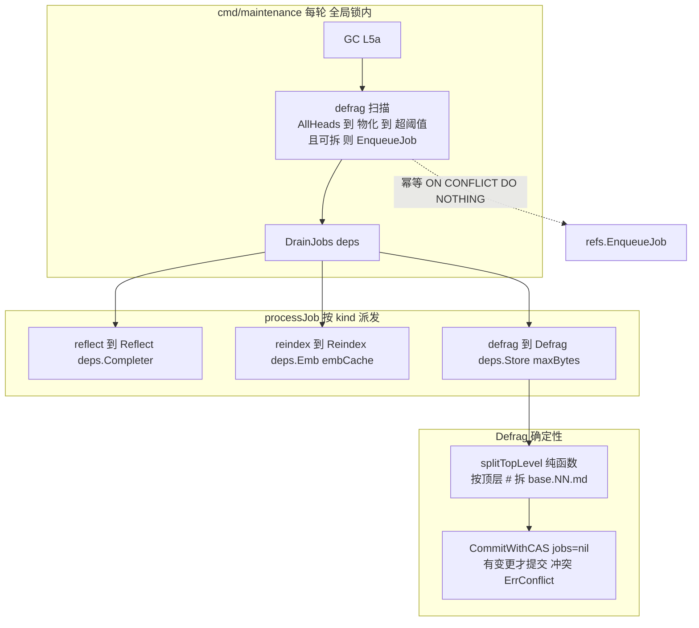
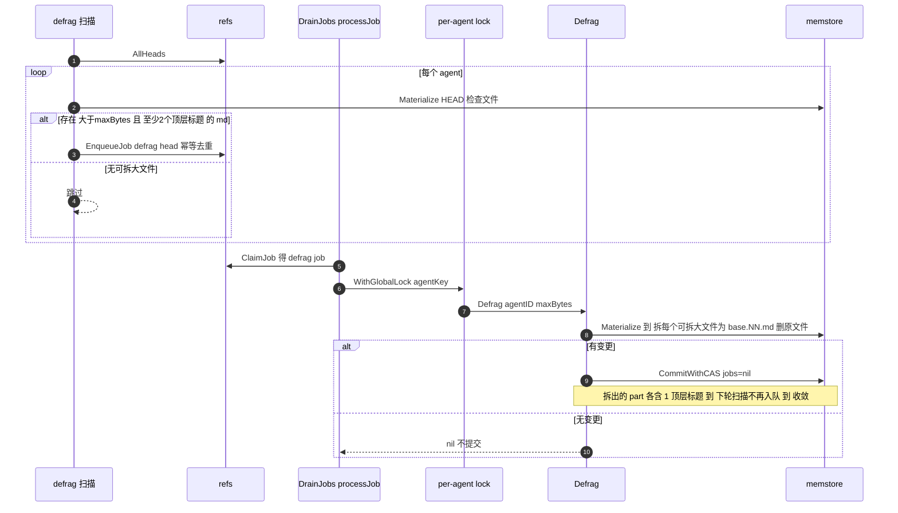

# Engram L5c — 确定性 defrag 设计

> 状态：已通过 brainstorm 评审（2026-06-24）。下一步：writing-plans。
> 依赖 L1（memstore/refs，memory_jobs + partial-unique）、L5a（cmd/maintenance worker round、WithGlobalLock）、L5b（DrainJobs/processJob、per-agent advisory lock、ErrConflict、reflect 同构模式）、L4b（reindex handler、Deps 之前的多参数现状）均已合并 main。
> 北极星：`architecture.md` §7（maintenance defrag）、CLAUDE.md「不让 system/ 无界增长，保持文件小」。
> L5c 之后仍剩：L5d 维护加固（stale-`running` reaper + embedding 淘汰）。

## 0. 决策前提（已对齐）

1. **确定性按顶层标题拆分**（无 LLM）：超阈值且可拆的 `.md` 文件按顶层 `#` 拆成兄弟小文件。纯函数、可测、可靠；语义重整/合并重复留后续。
2. **触发**：worker 每轮扫 `AllHeads`，对存在「超阈值+可拆」`.md` 的 agent 幂等入队 `defrag` job；走 DrainJobs（复用 L5b per-agent 锁/重试/冲突机制）。
3. **依赖传递**：引入 `maintenance.Deps` 结构体打包 handler 依赖，`DrainJobs(ctx, r, deps, maxAttempts)`，消除参数膨胀。

## 1. 范围

### In scope（L5c）
- `internal/maintenance`：`Deps` 结构体；`DrainJobs`/`processJob` 改用 Deps；`Defrag(ctx, store, agentID, maxBytes) error` + 纯 `splitTopLevel`；`defrag` 分支（per-agent 锁）；worker 轮内 defrag 扫描入队 helper。
- `internal/memstore/refs`：`EnqueueJob(ctx, agentID, kind, fromSHA) error`（幂等 `ON CONFLICT DO NOTHING`）。
- `cmd/maintenance`：构造 `Deps`（含 `ENGRAM_DEFRAG_MAX_BYTES`）；轮内调 defrag 扫描；DrainJobs 改用 Deps。

### Out of scope（后续）
- LLM 语义重整 / 合并重复内容。
- 多级标题（`##`+）递归拆分（只拆顶层 `#`）。
- 非 markdown 大文件处理。
- defrag 扫描的 cursor 节流（只扫 HEAD 变过的 agent，用已有 `maintenance_cursor`）——本层每轮全扫，记为后续。
- L5d reaper / embedding 淘汰。

## 2. 继承的不变量（L5c 不得破坏）

- 对象不可变、单点 CAS；defrag 走 `CommitWithCAS`，冲突放弃（不覆盖 agent 并发写入）。
- **`jobs=nil`**：defrag 的 commit 不入队任何 job（防自触发）。
- maintenance 不阻塞前台；defrag 持 per-agent advisory lock（维护侧单例），不取前台写锁。
- **收敛**：defrag 必须幂等且收敛——只对「>maxBytes 且 ≥2 顶层标题」动手，拆出的 part 各含 1 顶层标题 → 不再可拆 → 不再入队。无变更则不提交。
- `context.Context` 首参；`%w` 包错；小接口。

## 3. 组件设计

### 3.1 架构总览



### 3.2 defrag 收敛时序



### 3.3 splitTopLevel 纯函数（`internal/maintenance/defrag.go`）

```go
// splitTopLevel splits markdown content at top-level ('# ') headings into parts.
// A line is a top-level heading iff it starts with "# " (one hash + space) after
// trimming leading spaces — '##'+ are NOT split points. Content before the first
// top-level heading (preamble) becomes part[0] if non-empty. Returns the parts in
// order. If there are fewer than 2 parts, the content is not splittable (caller
// should leave it alone).
func splitTopLevel(content []byte) [][]byte
```
- 判定顶层标题：`strings.HasPrefix(strings.TrimLeft(line, " "), "# ")`（恰一个 `#` + 空格；`## ` 不算）。
- 每个 part 含其起始的 `# ` 行 + 直到下一个顶层标题之前的所有行。前言（首个顶层标题前的非空内容）为 part[0]。
- `len(parts) < 2` → 不可拆。

### 3.4 splittable 判定（共享）

```go
// isSplittable reports whether a file qualifies for defrag: a .md file larger
// than maxBytes with at least 2 top-level headings (so splitting strictly
// reduces the largest file — guarantees convergence).
func isSplittable(path string, content []byte, maxBytes int) bool
```
- `strings.HasSuffix(path, ".md")` && `len(content) > maxBytes` && `len(splitTopLevel(content)) >= 2`。
- 扫描与 Defrag 都用它，判定一致（收敛关键）。

### 3.5 maintenance.Defrag（`internal/maintenance/defrag.go`）

```go
func Defrag(ctx context.Context, store memstore.MemStore, agentID string, maxBytes int) error
```
- `head := ResolveHead`；临时目录 `Materialize`；遍历全树文件；对每个 `isSplittable` 的文件：`parts := splitTopLevel`，写 `<dir>/<base>.NN.md`（NN=01,02,…零填充，`<base>`=去掉 `.md` 的原名 + 所在目录），删原文件，记 changed=true。
- changed → `CommitWithCAS(ctx, agentID, head, dir, nil)`；`ErrCASConflict` → 返回 `ErrConflict`（复用 L5b 哨兵）；其它错 `%w`。
- 未 changed → 返回 nil（不提交、幂等）。
- 命名：`notes/big.md` → `notes/big.01.md`、`notes/big.02.md`（同目录兄弟文件，保序，无 slug 碰撞）。

### 3.6 refs.EnqueueJob（`internal/memstore/refs/refs.go`）

```go
// EnqueueJob idempotently enqueues a pending job out-of-band (not tied to a
// commit). The partial-unique index dedups concurrent pending jobs of the same
// (agent, kind); ON CONFLICT DO NOTHING makes a duplicate enqueue a no-op.
func (r *Refs) EnqueueJob(ctx context.Context, agentID, kind, fromSHA string) error {
	_, err := r.pool.Exec(ctx,
		`INSERT INTO memory_jobs (agent_id, kind, from_sha) VALUES ($1,$2,$3)
		 ON CONFLICT (agent_id, kind) WHERE state='pending' DO NOTHING`, ...)
}
```
- 注：partial-unique index 是 `(agent_id, kind) WHERE state='pending'`，故 `ON CONFLICT` 需匹配该部分索引谓词。
- 测试支持的 `InsertPendingJob` 保留（裸 INSERT，测试用确定性插入）；`EnqueueJob` 是生产幂等入队。

### 3.7 Deps + DrainJobs/processJob 重构（`internal/maintenance/drain.go`）

```go
type Deps struct {
	Store          memstore.MemStore
	Completer      Completer
	Emb            search.Embedder
	EmbCache       cache.Cache
	DefragMaxBytes int
}

func DrainJobs(ctx context.Context, r *refs.Refs, deps Deps, maxAttempts int) (int, error)
func processJob(ctx context.Context, r *refs.Refs, deps Deps, job *refs.DequeuedJob, maxAttempts int) error
```
- processJob 分支取所需字段：
  - `reflect`：per-agent 锁 → `Reflect(ctx, deps.Store, deps.Completer, job.AgentID, job.FromSHA)`。
  - `reindex`：`Reindex(ctx, deps.Store, deps.Emb, deps.EmbCache, job.AgentID)`。
  - `defrag`：per-agent 锁 → `Defrag(ctx, deps.Store, job.AgentID, deps.DefragMaxBytes)`。
  - unknown：CompleteJob（丢弃）。
- `seen` 防忙转、always-resolve（Complete/Retry）、processed 计数 不变。
- `Reflect`/`Reindex`/`Defrag` 自身签名不变；只是 processJob 从 deps 取参。

### 3.8 worker 轮内 defrag 扫描（`internal/maintenance`）

```go
// EnqueueDefrag scans all agents and enqueues a defrag job for any agent whose
// HEAD tree contains a splittable oversized file. Idempotent (EnqueueJob dedups).
func EnqueueDefrag(ctx context.Context, r *refs.Refs, store memstore.MemStore, maxBytes int) error
```
- `AllHeads` → 每个 agent：`Materialize` HEAD → 遍历文件 → 任一 `isSplittable` → `EnqueueJob(agentID,"defrag",head)`；找到一个即够（无需全列）。
- 单个 agent 出错（materialize 等）→ log 跳过、不中断整轮（best-effort 扫描）。

### 3.9 cmd/maintenance（`cmd/maintenance/main.go`）

- 构造 `deps := maintenance.Deps{Store: store, Completer: completer, Emb: emb, EmbCache: embCache, DefragMaxBytes: envInt("ENGRAM_DEFRAG_MAX_BYTES", 16384)}`。
- 轮内（全局锁内）顺序：GC → `maintenance.EnqueueDefrag(ctx, r, store, deps.DefragMaxBytes)`（log 错误不中断）→ `maintenance.DrainJobs(ctx, r, deps, maxAttempts)`。
- `envInt` helper（若无则加）。

## 4. 错误处理

- Defrag CAS 冲突 → `ErrConflict` → processJob `RetryJob`（与 reflect 一致）；其它错 → RetryJob。
- EnqueueDefrag 单 agent 出错 → log + 继续（扫描 best-effort，不阻塞 GC/drain）。
- EnqueueJob 失败 `%w` 返回（调用方 EnqueueDefrag log 之）。
- **收敛保证**：isSplittable 在扫描与 Defrag 用同一判定；拆后 part 各 1 顶层标题 → 不再 splittable → 不再入队。无可拆变更 → 不提交。防止无限 commit/enqueue。

## 5. 测试策略（表驱动）

- **splitTopLevel**（纯函数，无 DB）：多顶层标题 → N parts，每 part 含其 `# ` 行；前言归 part[0]；`## ` 不拆；0/1 标题 → <2 parts（不可拆）；空内容 → 0 parts。
- **isSplittable**：.md + >maxBytes + ≥2 顶层标题 → true；非 .md / ≤maxBytes / <2 标题 → false（逐条）。
- **Defrag**（live PG + reflectStore）：建 agent 含一个大（>maxBytes）多标题 `notes/big.md` → `Defrag` → 断言新 HEAD 无 `notes/big.md`、有 `notes/big.01.md`/`.02.md`、内容分段正确；**幂等**：第二次 `Defrag` → HEAD 不变（part 各 1 标题、不可拆、无变更不提交）。CAS 冲突路径：用 L4b/L5b 的 advancing-HEAD 包装 → `ErrConflict`。无可拆文件的 agent → Defrag 无提交、HEAD 不变。
- **EnqueueJob**（schema-isolated，复用 isolatedPool）：入队一个 pending → 再 EnqueueJob 同 (agent,kind) → 仍只 1 行（ON CONFLICT DO NOTHING）；state 非 pending 时可再入队。
- **EnqueueDefrag**（schema-isolated + store）：建有大可拆文件的 agent → EnqueueDefrag → 该 agent 有 pending defrag job；建无大文件的 agent → 无 job。
- **DrainJobs defrag 路径**（schema-isolated + Deps）：入队 defrag → DrainJobs(deps) → 文件被拆 + job 完成。复用既有 reflect/reindex drain 测试（改用 Deps 构造）。
- **cmd/maintenance**：build + 冒烟（seed 大文件 agent，跑一轮，log 显示 defrag 入队/处理 / HEAD 推进）。
- 全套 `go test ./...`（隔离已修）+ `-race`（maintenance、refs）。

## 6. L5c 完成标志（DoD）

worker 每轮扫描 agent 并对超阈值+可拆 `.md` 幂等入队 defrag；defrag job 在 per-agent 锁下确定性按顶层标题拆分大文件为 `<base>.NN.md`、CAS 提交（jobs=nil 不自触发）、冲突 requeue；拆分收敛（拆后不再可拆、第二次 defrag 无变更不提交）；`splitTopLevel`/`isSplittable` 纯函数单测覆盖边界；`Deps` 结构体消除 DrainJobs 参数膨胀；`refs.EnqueueJob` 幂等入队。全套 `go test ./...` + `-race` 绿。

## 7. 守则（继承自 CLAUDE.md）

- 不引入新依赖；defrag 纯 stdlib 字符串处理。
- 不修改对象；defrag 经 CommitWithCAS，冲突放弃不覆盖。
- 并发控制：defrag 持 per-agent advisory lock（维护侧），前台仍只在 ref CAS 序列化。
- 不让 system/ 无界增长——defrag 拆大文件是这条守则的执行者之一。
- 收敛优先：只做能严格减小最大文件的拆分，杜绝无限循环。
