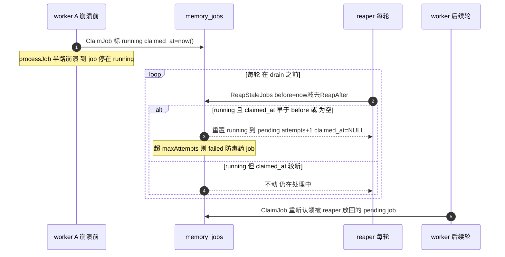

# Engram L5d — stale-`running` job reaper 设计

> 状态：已通过 brainstorm 评审（2026-06-25）。下一步：writing-plans。
> 依赖 L1（refs/memory_jobs、golang-migrate）、L5a（cmd/maintenance round）、L5b（ClaimJob/RetryJob、DrainJobs、maxAttempts）均已合并 main。
> 北极星：`architecture.md` §14（stale-`running` job reaper open question，本层关闭它）。
> 范围决策：**仅 reaper**；embedding 淘汰暂缓（推测性、按创建龄期 TTL 有 hot-eviction wart、当前无压力、embedding 是小文本）。

## 0. 问题

`ClaimJob` 把 job 标 `running`；若 worker 在 `processJob` 半路崩溃，该行永久停在 `running`。`ClaimJob` 只选 `pending`，故该 job 永不被重试——静默搁浅。本层加一个**认领时间戳 + 每轮 reaper 扫描**关闭它。

## 1. 范围

### In scope（L5d）
- 迁移 `000002`：`memory_jobs` 加 `claimed_at timestamptz`（nullable，expand）。
- `internal/memstore/refs`：`ClaimJob` 标 running 时设 `claimed_at=now()`；`RetryJob` requeue 时 `claimed_at=NULL`；新增 `ReapStaleJobs(ctx, before time.Time, maxAttempts int) (int, error)`。
- 两个 `isolatedPool` 测试 DDL 同步加列（`jobqueue_test.go`、`drain_test.go`）。
- `cmd/maintenance`：`ENGRAM_JOB_REAP_AFTER`（默认 10m）；每轮在 DrainJobs **之前** reap；log reaped 数。

### Out of scope（后续/已决策延后）
- embedding-store 淘汰（按访问的 LRU 需 touch-on-read，S3 不友好；按创建龄期 TTL 会误删热 embedding）。
- 多 worker 下的 reap 协调（当前单 worker；多 worker 注意点见 §4）。
- River 迁移。

## 2. 继承的不变量（L5d 不得破坏）

- 单点 CAS、对象不可变：reaper 只改 `memory_jobs` 行状态（队列是 Postgres 协调态，非对象），不碰对象/ref。
- 队列状态机：`pending → running → (done=删除 | failed)`；reaper 是 `running → pending|failed` 的恢复边（worker 死亡时）。
- maintenance 不阻塞前台；reaper 是后台轮内一条 `UPDATE`。
- `context.Context` 首参；`%w` 包错；迁移 expand-contract、不破坏。

## 3. 组件设计

### 3.1 reaper 生命周期时序



### 3.2 迁移 000002（`internal/memstore/refs/migrations/`）

`000002_claimed_at.up.sql`：
```sql
ALTER TABLE memory_jobs ADD COLUMN claimed_at timestamptz;
```
`000002_claimed_at.down.sql`：
```sql
ALTER TABLE memory_jobs DROP COLUMN claimed_at;
```
- expand（仅加 nullable 列），非破坏；现有行 `claimed_at=NULL`。
- `refs.Migrate` 走 golang-migrate 自动应用（确认 embed glob `migrations/*.sql` 覆盖新文件——若用 `//go:embed`，`*.sql` 通配自动包含）。
- `reflectStore` 测试经 `refs.Migrate` 自动拿到列；`isolatedPool`（手建表）需在两处 DDL 加 `claimed_at timestamptz`。

### 3.3 refs 改动（`internal/memstore/refs/refs.go`）

- **ClaimJob** 的 mark-running（当前 `UPDATE memory_jobs SET state='running' WHERE id=$1`）改为：
  ```sql
  UPDATE memory_jobs SET state='running', claimed_at=now() WHERE id=$1
  ```
- **RetryJob**（当前 `SET attempts=attempts+1, state=CASE...`）加 `claimed_at=NULL`：
  ```sql
  UPDATE memory_jobs
  SET attempts = attempts + 1,
      state = CASE WHEN attempts + 1 >= $2 THEN 'failed' ELSE 'pending' END,
      claimed_at = NULL
  WHERE id=$1
  ```
- **新增 ReapStaleJobs**：
  ```go
  // ReapStaleJobs returns stale 'running' jobs (claimed before `before`, or with a
  // NULL claimed_at) to the queue: attempts is bumped (poison-job protection —
  // a job that crashes the worker on every claim fails out at maxAttempts), state
  // becomes 'pending' (or 'failed' at the cap), claimed_at is cleared. Returns the
  // number of jobs reaped.
  func (r *Refs) ReapStaleJobs(ctx context.Context, before time.Time, maxAttempts int) (int, error) {
      tag, err := r.pool.Exec(ctx,
          `UPDATE memory_jobs
           SET attempts = attempts + 1,
               state = CASE WHEN attempts + 1 >= $2 THEN 'failed' ELSE 'pending' END,
               claimed_at = NULL
           WHERE state='running' AND (claimed_at IS NULL OR claimed_at < $1)`,
          before, maxAttempts)
      if err != nil {
          return 0, fmt.Errorf("refs: reap stale jobs: %w", err)
      }
      return int(tag.RowsAffected()), nil
  }
  ```
- `before` 显式传入（不在 SQL 用 `now()`）→ 可注入、可测。

### 3.4 cmd/maintenance（`cmd/maintenance/main.go`）

- env `ENGRAM_JOB_REAP_AFTER`（duration，默认 `10m`，用现有 `dur` helper）。
- 轮内（全局锁内）顺序：GC → **reap** → defrag 扫描 → DrainJobs。reap 在 drain 之前，使 reaped→pending 当轮即被处理：
  ```go
      reaped, rerr := r.ReapStaleJobs(ctx, time.Now().Add(-reapAfter), maxAttempts)
      if rerr != nil {
          log.Printf("reap error: %v", rerr)
      } else if reaped > 0 {
          log.Printf("reaped: %d stale running jobs", reaped)
      }
  ```
  （reap 出错 log 不中断整轮——best-effort，与 defrag 扫描一致。）

## 4. 错误处理 / 假设

- `ReapStaleJobs` 失败 `%w`；worker 轮内 reap 出错 log + 继续。
- **reap-after 须 > 最长 job 时长**：单 worker 下 job 仅在 processJob 期间短暂 running（秒级），10m 极安全。
- **多 worker 注意点（当前不适用）**：若将来多 worker 并发，一个在 worker B 上跑 >reap-after 的长 job 会被 worker A 误 reap（→ 重复执行）。缓解：reap-after 取远大于任何 job 时长，或加 worker 心跳。当前单 worker，不涉及。
- `claimed_at IS NULL` 也 reap：兜底迁移前/异常的 running 行；当前代码认领必设 claimed_at，正常 running 不会被误伤。

## 5. 测试策略（表驱动）

- **ClaimJob 设 claimed_at**（schema-isolated）：入队 → ClaimJob → 查该行 `claimed_at` 非空 且 state='running'。
- **RetryJob 清 claimed_at**：claim（claimed_at 非空）→ RetryJob → `claimed_at` 为 NULL、state pending。
- **ReapStaleJobs**（schema-isolated）：
  - 插一个 `state='running', claimed_at=<旧>` → `ReapStaleJobs(before=旧+1min, max=5)` → count=1、该行 state pending、attempts+1、claimed_at NULL。
  - 插 `running, claimed_at=<新>` → `ReapStaleJobs(before=新-1min)` → count=0、不动。
  - 插 `running, attempts=maxAttempts-1, claimed_at=<旧>` → reap → state='failed'。
  - 插 `running, claimed_at=NULL` → reap → 被回收（IS NULL 分支）。
  - 不碰 `pending`/`failed` 行。
- **迁移**：`isolatedPool` 两处 DDL 加列后测试通过；`reflectStore` 经真 Migrate（无需改）。
- **cmd/maintenance**：build + 冒烟（log 出现 worker 启动；reaped 行可选——无 stale job 时不打印）。
- 全套 `go test ./...`（隔离已修）+ `-race`（refs、maintenance）。

## 6. L5d 完成标志（DoD）

迁移加 `claimed_at`；`ClaimJob` 记认领时间、`RetryJob` 清除；`ReapStaleJobs` 把超时（或 NULL claimed_at）的 `running` job 撞 attempts 后回 `pending`（超 maxAttempts→`failed`）；worker 每轮在 drain 前 reap，崩溃中途的 job 当轮被回收并重新处理，不再永久卡 `running`。两个 isolatedPool DDL 同步加列。全套 `go test ./...` + `-race` 绿。`architecture.md §14` 的该 open question 关闭。

## 7. 守则（继承自 CLAUDE.md）

- 不引入 Temporal/Kafka；reaper 是一条 Postgres `UPDATE`，River 仍留 drop-in。
- 迁移 expand-contract、非破坏。
- 并发控制：reaper 不引入新锁；它是队列状态机的恢复边，前台仍只在 ref CAS 序列化。
- best-effort：reap 出错不阻塞 GC/defrag/drain。
